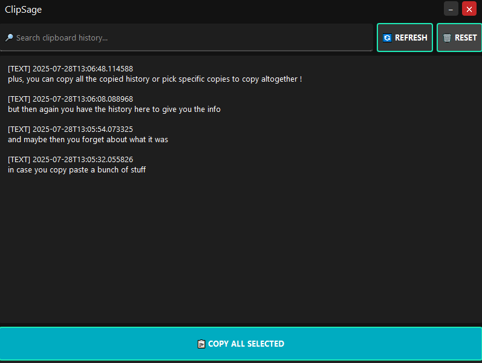

# ClipSage

**ClipSage** is a modern, intelligent clipboard manager for desktop environments — built with Python and PyQt5.  
It features full clipboard history, OCR for images, multi-selection, and a sleek, dark user interface with toast-style notifications.

---

## ✨ Features

- ✅ Automatically saves clipboard **text and image content**
- ✅ Runs silently in the background and monitors changes
- ✅ Extracts **text from copied images** using OCR (Tesseract)
- ✅ Modern GUI built with **PyQt5** and styled using `qt-material`
- ✅ Multi-select items and **copy all together** in one click
- ✅ **Reset** clipboard history with a single button
- ✅ No annoying popups — uses **toast notifications**
- ✅ Clean, dark, frameless window with a minimal aesthetic

---

## 📦 Technologies Used

| Area         | Tech Used           |
|--------------|---------------------|
| GUI          | PyQt5 + qt-material |
| Clipboard    | pyperclip, ImageGrab |
| OCR          | pytesseract + Tesseract OCR engine |
| Storage      | SQLite (via `sqlite3`) |
| Image Saving | Pillow (PIL)        |

## 📸 Screenshots

Here’s how the dark-mode UI looks:

## 🚀 How to Run

1. **Install dependencies** (inside a virtualenv recommended):

pip install pyqt5 qt-material pyperclip pillow pytesseract
Install Tesseract OCR (if not installed already)

📦 Download: https://github.com/UB-Mannheim/tesseract/wiki

On Windows, install to:
C:\Program Files\Tesseract-OCR

Add it to your system PATH
Or set the path in ocr.py using:

import pytesseract
pytesseract.pytesseract.tesseract_cmd = r"C:\Program Files\Tesseract-OCR\tesseract.exe"
Run the app:

python main.py
🧠 How It Works
The app launches a background thread that watches your clipboard

When you copy text or an image:

Text is saved directly

Images are passed through OCR to extract readable text

All entries are stored in a local SQLite database

You can search, multi-select, and copy again from the history

🧼 Keyboard Shortcuts & Tips
Action	How
Move window	Click and drag the top bar
Select multiple	Ctrl+Click or Shift+Click
Refresh	🔄 Refresh button
Reset DB	🗑 Reset button
Copy All	📋 Copy All Selected

🛡️ Privacy
Your clipboard history is stored locally only
No internet or cloud connection is used.

💡 Roadmap Ideas
 Auto-tagging (URLs, code snippets)

 Smart filters (e.g., only images, only links)

 Export to .txt or .md

 Pin favorite items

 Autostart with OS

🤝 Contributing
Pull requests welcome.
Built with ❤️ by Dylan.

📄 License
This project is licensed under the MIT License.
See LICENSE for details.
